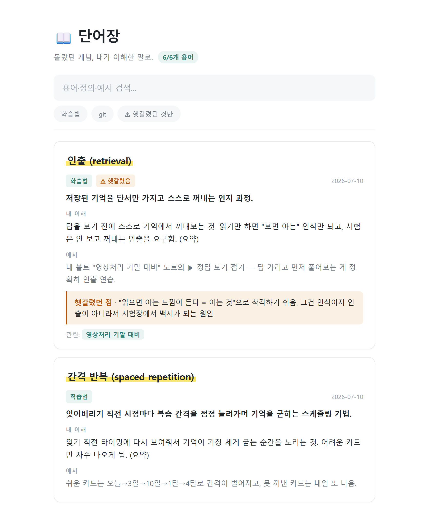

# 📖 Confusing-Words-Vocab-skill — a glossary of what *you* didn't know, in your own words

**Concepts you learn in AI conversations evaporate when the session ends.**

Confusing-Words-Vocab-skill (installed and invoked as `vocab`) is a Claude Code skill that captures the terms you didn't know — written as **your own final understanding**, not dictionary copy-paste — into a plain markdown file, and republishes the whole glossary as a single web page (Claude Artifact) whose **URL never changes**. Bookmark it once on your phone; it keeps growing across every session.



## Why "my understanding" instead of definitions?

The generation effect: definitions you reconstruct in your own words stick far better than ones you copy. vocab treats your sentence — "so it's basically X, right?" — as the first-class definition, and marks Claude-written summaries explicitly.

## Features

- ✍️ **Your words first** — the definition of record is the one *you* reconstructed; Claude's summaries are tagged `(summarized)`
- ⚠️ **Confusion tracking** — what you misunderstood is stored per term and filterable ("confused only" = your personal error notebook, the highest-value pre-exam review)
- 🔗 **Fixed-URL artifact** — one self-contained page with live search and subject filters, republished in place; the bookmark never breaks
- 🙋 **Proposal trigger** — when a concept Q&A happens, Claude offers "add this to your vocab?" — never adds silently, never interrupts mid-task
- 📄 **Plain markdown store** — works beautifully inside an Obsidian vault (`[[links]]` supported), or as a standalone `~/vocab.md`

## Installation

```bash
cd ~/.claude/skills
git clone https://github.com/Longarden/Confusing-Words-Vocab-skill vocab
```

That's it. Open Claude Code and say **"add this to my vocab"** after learning something.

## Usage

| You say | What happens |
|---------|--------------|
| "add to my vocab" / "단어장에 추가해" | Extracts concept terms from this session → appends to your store → republishes the page |
| "show my vocab" / "단어장 보여줘" | Republishes / summarizes your glossary |
| (nothing) | After a concept Q&A, Claude offers to add it — you just say yes or no |

## How it works

```
concept Q&A in any session
        │  (you approve the offer, or call it explicitly)
        ▼
markdown store  ←  single source of truth (yours to edit, Obsidian-friendly)
        │
        ▼
self-contained HTML regenerated from the full store
        │
        ▼
Artifact republished to the SAME url  →  your bookmark, always current
```

## Configuration

On first run the skill asks where to keep your store and writes `config.json` (gitignored, personal):

```json
{
  "storePath": "/path/to/your/vocab.md",
  "artifactHtmlPath": null,
  "artifactUrl": null
}
```

- `storePath` — your markdown glossary (an Obsidian vault file works great)
- `artifactHtmlPath` — `null` = auto (generated inside the skill folder)
- `artifactUrl` — filled automatically after the first publish; keeps the URL stable across sessions

See `config.example.json`.

## Entry format

```markdown
## backpropagation
- subject: deep-learning
- date: 2026-07-10
- definition: Algorithm that propagates the loss gradient backwards through the network to update weights.
- my-understanding: The error "flows backward" — each layer learns how much it contributed to the mistake via the chain rule.
- example: In our lab CNN, freezing early layers stopped gradients from updating them — that's backprop being cut off.
- confusion: I thought the forward pass updated weights too. It doesn't — forward only computes, backward updates.
```

Duplicate terms are merged (latest understanding wins); resolved confusions are removed.

---

## 한국어 Quick Start

AI한테 배운 개념, 세션 끝나면 증발하죠. vocab은 **몰랐던 용어를 "내가 이해한 문장"으로** 마크다운 단어장에 쌓고, 전체를 **URL이 바뀌지 않는** Artifact 페이지로 재발행하는 Claude Code 스킬입니다.

```bash
cd ~/.claude/skills
git clone https://github.com/Longarden/Confusing-Words-Vocab-skill vocab
```

- **"단어장에 추가해"** — 이 세션에서 몰랐던 개념을 추출해 저장 + 페이지 갱신
- **"단어장 보여줘"** — 단어장 페이지 재발행
- 개념 문답이 나오면 Claude가 먼저 **"단어장에 넣을까?"** 하고 물어봅니다 (몰래 추가 안 함)
- `confusion`(헷갈림) 필드가 있는 용어는 ⚠ 필터로 모아보기
- 저장소는 옵시디언 볼트 안 파일로 두면 `[[링크]]`·그래프까지 연동됩니다

## License

MIT © 2026 Longarden
